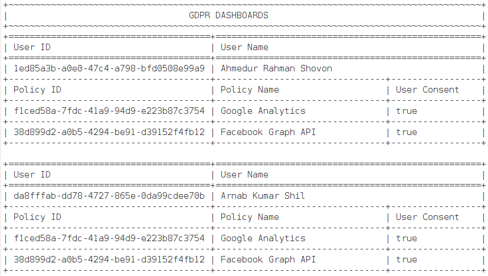

## GDPR Dashboard


Final project of Effective Object Oriented Programming course from Cefalo School

### Abstract:
We want to design a system which will contain User, Privacy Policy, Settings. User will contain User specific information.
Privacy policy will contain consents for User.
Finally Settings which will bridge between Privacy policy and User; it will contain if user has complied to a certain consent or not.

### Features:
- **GDPR dashboards**: We can show GDPR dashboards of all users
- **Policy maintenance**: Adding new policy or deleting existing policy will be reflected on all users
- **Users sync with policies**: When a new user is added to he/she will be synced with current policies.
- **Default values for policies**: When a new policy is added, it has a deafult user choice value.
- **Initial set of policies and users**: When the project runs for the first time it will import a set of users and policies from user given files.

### Team:
- Ahmedur Rahman Shovon
- Arnab Kumar Shil

### Technology:
- Java

### Screencast


### Project Management
We managed our project through [this](https://github.com/arsho/GDPRDashboard/projects/1) board.


### Publicatoin
A. R. Shovon, S. Roy, A. K. Shil and T. Atik, "[GDPR Compliance: Implementation Use Cases for User Data Privacy in News Media Industry](https://ieeexplore.ieee.org/document/8934660)," 2019 1st International Conference on Advances in Science, Engineering and Robotics Technology (ICASERT), 2019, pp. 1-6, doi: 10.1109/ICASERT.2019.8934660.


### Citation

```
@inproceedings{shovon2019gdpr,
  title={GDPR compliance: implementation use cases for user data privacy in news media industry},
  author={Shovon, Ahmedur Rahman and Roy, Shanto and Shil, Arnab Kumar and Atik, Tanjila},
  booktitle={2019 1st International Conference on Advances in Science, Engineering and Robotics Technology (ICASERT)},
  pages={1--6},
  year={2019},
  organization={IEEE}
}
```
